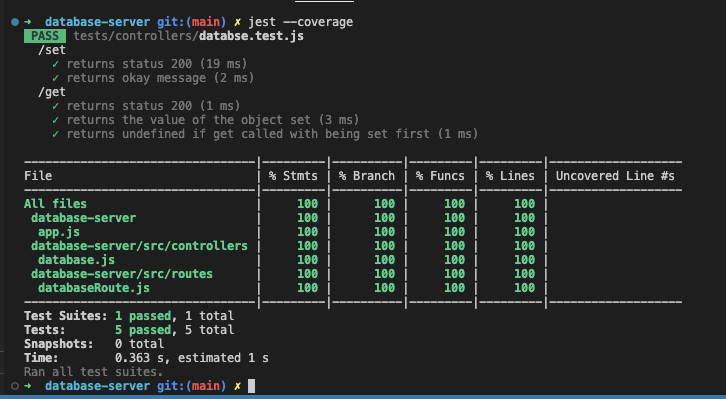

# Database-Server

You receive a message from a prospective employer:

"Before your interview, write a program that runs a server that is accessible on `http://localhost:4000/`. When your server receives a request on `http://localhost:4000/set?somekey=somevalue` it should store the passed key and value in memory. When it receives a request on `http://localhost:4000/get?key=somekey` it should return the value stored at `somekey`. Store the data in memory, not in a database, but bear in mind that you will later need to add a database to this code."

# Example usage:

`npm install`

`npm start`

Sending put request to store key and value:

`PUT localhost:4000/set?car=Audi`

Retrieving value based on key:

`GET localhost:4000/get?key=car`

# Testing

How to run tests:

`jest`

Test coverage:

